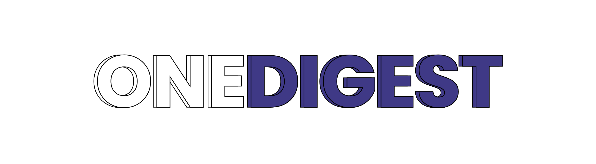

# OneDigest

<div align="center">
  
</div>

OneDigest is a Flutter-based application that provides a comprehensive news digest service. It allows users to stay informed by aggregating and presenting news content in an organized and accessible format.

## Features

- 🔐 Secure user authentication using Firebase
- 📰 News content aggregation and display
- 🎯 Personalized news feed
- 📱 Cross-platform support (Android, iOS, Web)
- 🔊 Text-to-Speech functionality for news articles
- 📧 Email newsletter capabilities
- 📄 PDF generation for news digests
- 🌐 WebView integration for full article reading

## Prerequisites

- Flutter SDK (version 3.7.0 or higher)
- Dart SDK
- Firebase project setup
- Android Studio / Xcode (for mobile development)
- VS Code (recommended IDE)

## Getting Started

1. Clone the repository:
```bash
git clone [repository-url]
cd onedigest
```

2. Install dependencies:
```bash
flutter pub get
```

3. Configure Firebase:
   - Create a new Firebase project
   - Add your Firebase configuration files
   - Enable Authentication and Firestore services

4. Run the application:
```bash
flutter run
```

## Dependencies

- `firebase_core`: ^2.10.0
- `firebase_auth`: ^4.8.1
- `cloud_firestore`: ^4.8.0
- `webview_flutter`: ^4.0.7
- `flutter_tts`: ^4.2.3
- `pdf`: ^3.10.7
- `mailer`: ^6.1.0
- And more (see pubspec.yaml for complete list)

## Project Structure

```
lib/
├── main.dart
├── pages/
│   ├── auth_page.dart
│   └── home_page.dart
├── services/
├── widgets/
└── utils/
```

## Contributing

1. Fork the repository
2. Create your feature branch (`git checkout -b feature/AmazingFeature`)
3. Commit your changes (`git commit -m 'Add some AmazingFeature'`)
4. Push to the branch (`git push origin feature/AmazingFeature`)
5. Open a Pull Request

## License

This project is licensed under the MIT License - see the LICENSE file for details.

## Acknowledgments

- Flutter team for the amazing framework
- Firebase for backend services
- All contributors who have helped shape this project
